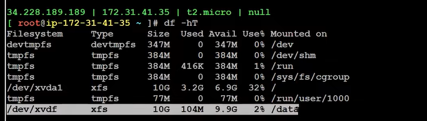

### Attach EBS Volume to running EC2 instance

*** NOTE ***

* EBS Volume should be in same availability zone, where your EC2 instance is running 

Steps :
By default you cant see the volume in linux server, we need to do some configuration.

//R Google :"How to add ebs  volume to the running EC2 instance"
https://docs.aws.amazon.com/AWSEC2/latest/UserGuide/ebs-using-volumes.html

if you run the command (lsblk ->retrieved by googling),then you can see the volumes attached

You can check the volume availble or not using below command

---lsblk---

Create file system from volume
.........
sudo mkfs -t xfs /dev/xvdf
..........

Make a directory ,it is just like when you attach a pendrive/hardidk in windows a new directory "G" will be created like in the same way in Linux we need to create drive using below command.
We are mounting an extra volume ,we need to create the directory manually
...
sudo mkdir /data
...

You r telling the linux , mount the created file system to this diractory "data" by using below command
....
sudo mount /dev/xvdf /data
....
Now check df -hT

--
Now two hard disk are availble , why i am telling is we need to loop it
In realtime projects we have more volumes attached.

Now , you need to send email for all the disks attached to EC2 instance ,that is why i added another disk